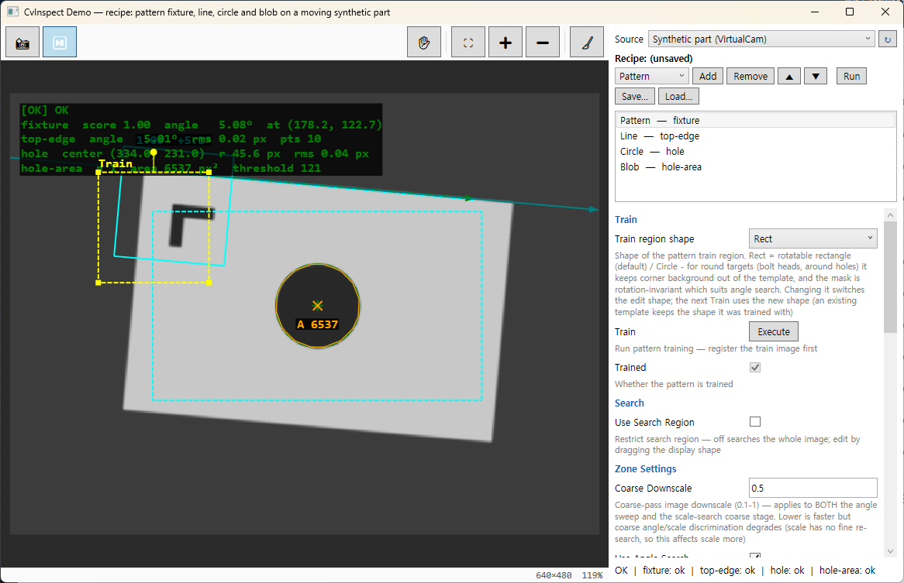

# CvInspect.Demo



One window that wires the whole toolkit together as a **recipe** — an ordered list of tools where
each tool sees what the tools above it produced:

```
VirtualCam (folder playback) ──CamFrame──▶ CvDispCtrl.Frame                          (held by reference, no copy)
                               └──AsMat()──▶ DemoRecipeRunner.Run(recipe)
                                              ├─ Preprocess   CvImageOps.Preprocess ──▶ stage image + CvSpaceMap (stage → original)
                                              ├─ Pattern      CvInspGeom.MatchPattern ──CvPose──▶ fixture for every tool below it
                                              ├─ Line/Circle/Blob   run at XformByPose(taught geometry), in their own stage space
                                              └─ per tool: OK/NG, one-line summary, ViOverlay ──OverlayFor(stage)──▶ CvDispCtrl.Overlay
CvPropEditCtrl ◀── the selected tool's Cv*Opt ──▶ CvShapeBinder ──▶ draggable shapes on that tool's stage image
DemoRecipe.Save / Load ◀──▶ a folder: Recipe.json + {key}.json per tool + {key}.Template.png per trained pattern
```

The part is synthetic (`DemoImage`): a bright plate on a dark background with a dark hole in the
middle and a dark "L" mark near one corner. Six frames of it — shifted and rotated a little each —
are written under the temp folder and played back by `VirtualCam`, so the frames arrive through the
same `ICam` path a real camera would use, and the part visibly moves in live mode.

**The fixture** is the point of the demo. The pattern tool trains on the plate corner with the L mark
(automatically on the first frame; press **Train** in the editor to redo it after moving the yellow
train box). Every run matches it, gets a `CvPose`, and `CvInspGeom.XformByPose` moves the taught line
segment, circle centre and blob search rectangle of every tool *below it in the list* onto the found
part before they run — the cyan dashed geometry shows where they actually ran, the yellow shapes stay
where you taught them. Untrained, the tools run at the taught geometry and fail honestly once the
part moves.

**Stages.** A Preprocess tool (crop → area-resize by `SampleX`/`SampleY` → median, `CvImageProcessOpt`)
changes the image every tool below it sees, and their geometry is taught in that stage's
coordinates. Select such a tool and the display switches to its stage image, so you drag shapes on
what the tool actually sees. Each tool's result is mapped back through `CvSpaceMap`, so the overlay
of every tool lands on whichever stage is displayed — and a fixture found in one stage still moves
tools in another.

**Live webcam.** The *Source* box lists every USB camera on the PC by name and VID/PID (`UsbCamId`) next to
the synthetic part, and opens the one you pick through `CamOpt.SerialNumber` — so it is the same camera
no matter which OpenCV index it got today. Frames arrive in colour at 30 fps; the tools see them grey, and
when the UI falls behind only the newest frame is processed. Nothing is trained automatically on a live
camera: drag the yellow train box onto a feature of your object, press **Train**, then move the object —
the fixture follows it, and the cyan geometry with it.

**The recipe folder.** *Save…* writes a folder: `Recipe.json` (order, keys, kinds), one `{key}.json`
per tool (the option POCO as-is, enums as strings) and `{key}.Template.png` for each trained
pattern — readable and diffable, no binary blob. *Load…* brings it back including the trained
template, and the loaded recipe produces the identical run. An unsaved change puts `*` in the title.

## Try

- **📸 / ⏯️** on the toolbar grab one frame or stream the moving part at 2 fps — watch the cyan
  geometry follow it while the yellow taught shapes stay put.
- **Add / Remove / ▲ ▼** build the chain. Order matters: a pattern moves only the tools below it,
  a Preprocess changes the image only for the tools below it. Move the fixture below the circle and
  the circle stops following.
- **Put a Preprocess first** with `SampleX`/`SampleY` = 2, then drag the shapes of the tools below it
  on the half-size image (or halve their numbers in the editor) — select any tool above the
  Preprocess and the results still land on the right spot of the original.
- **Drag the search shape** (the line's segment, the circle's expected arc, the blob's search
  rectangle) — the tool re-runs as you drag, because the shape writes straight back into the
  option POCO. Widen the blob rectangle past the plate and watch the dark background become the
  biggest blob: the search region is what keeps the hole the only hit.
- **Edit a parameter** in the right pane (calipers, search length, polarity, gates) — every
  commit re-runs the recipe. Hover a label for its description.
- **Right-click → Load image** to inspect a file of your own; 8-bit 1/3/4-channel formats only.
- **Source → your webcam**, then teach the fixture on something in view and move it. Press **↻** after
  plugging a camera in. `CvInspect.Demo.exe --webcam` starts straight into the first camera,
  `--webcam VID_046D&PID_0825` (or an instance id) into that one.
- On the pattern tool, drag the train box somewhere featureless and press Train to see the
  refusal. The blob tool reports every blob above `MinArea` — count, area, centroid and contour —
  not just the largest.
- **Save…** the recipe to a folder, open the JSON files, change a number, **Load…** it back.

## Run

A self-contained single-file build (`CvInspect.Demo.exe`, Windows x64, nothing to install) is
attached to every [GitHub release](https://github.com/cmir79/CvInspect/releases/latest). From source:

```
dotnet run --project samples/CvInspect.Demo
```

Windows only (WPF). A USB webcam is optional — without one the source list holds only the synthetic
part. The recipe runner (`DemoRecipeRunner`) is pure and deterministic — the WPF test
suite trains the default recipe on the reference part, runs it on a shifted-and-rotated one and checks
that the pose angle, the followed line, circle and blob all land within a pixel of where the geometry
went; saves and reloads a recipe and checks the run is identical; and runs a half-resolution stage to
check that the space maps hold both ways.
